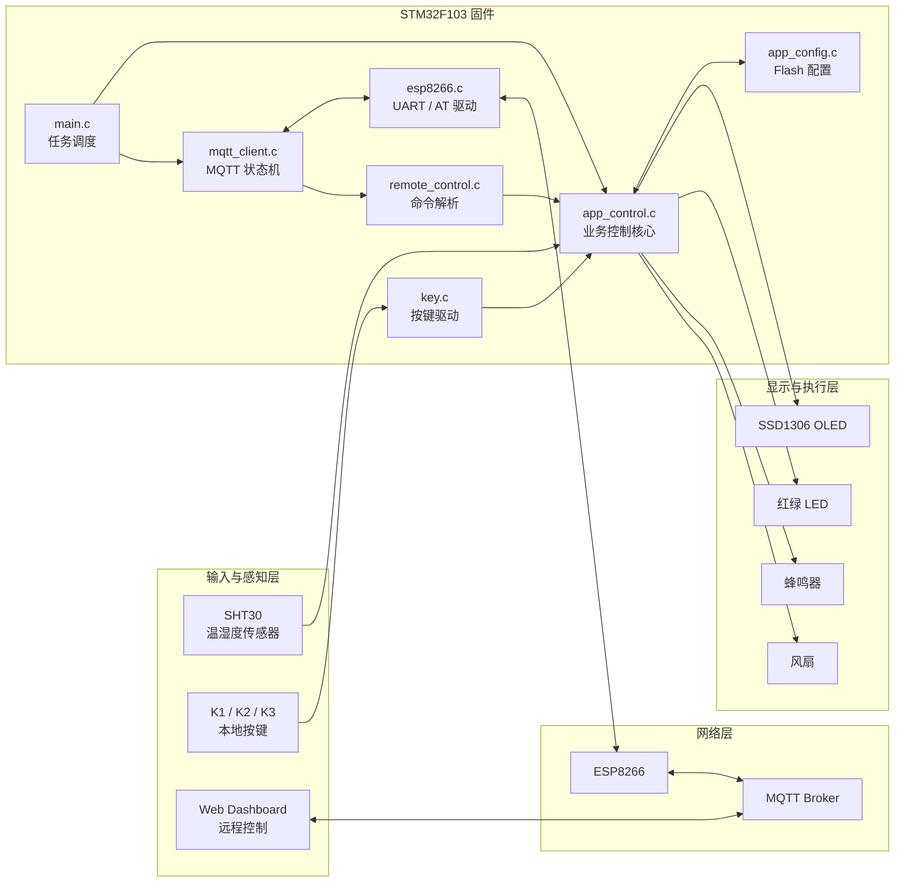
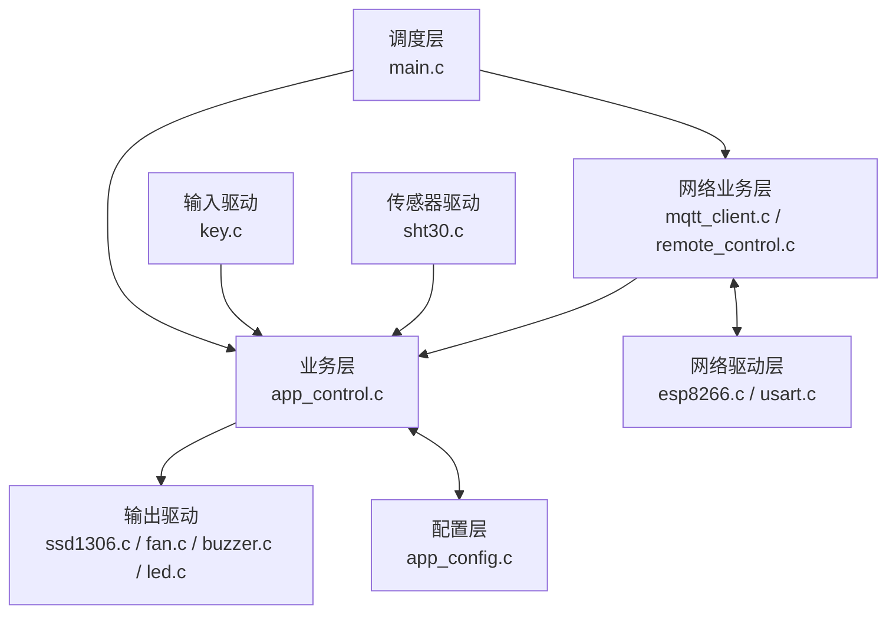
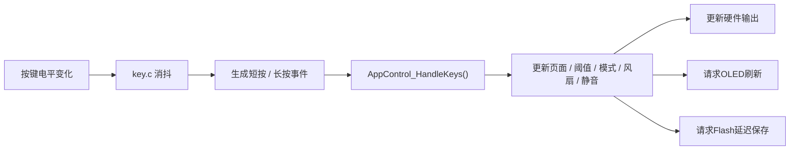
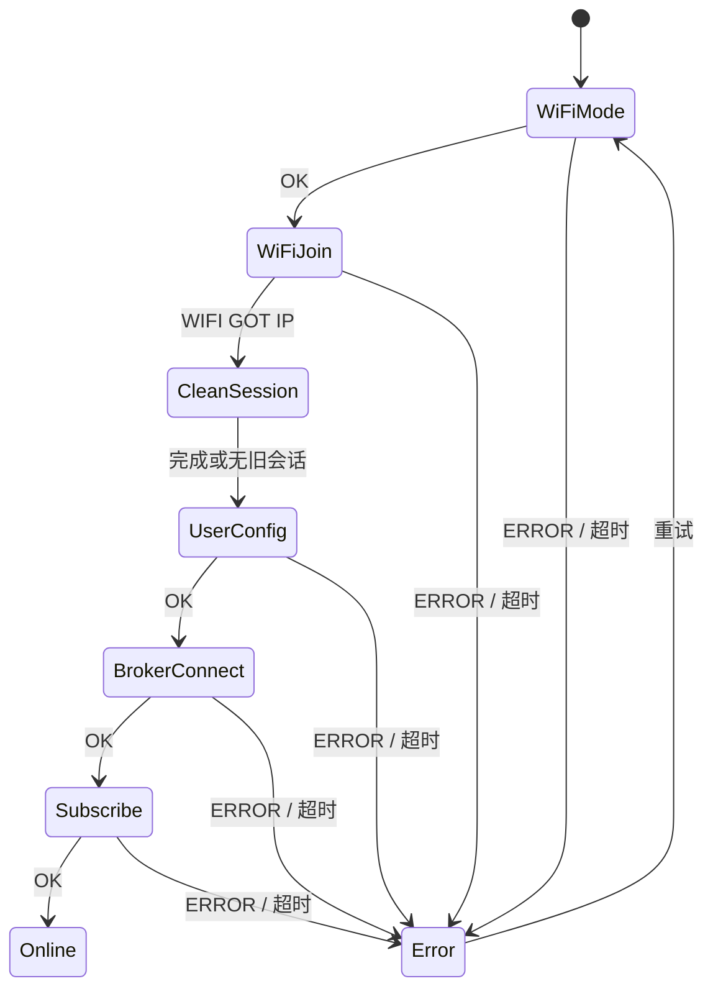
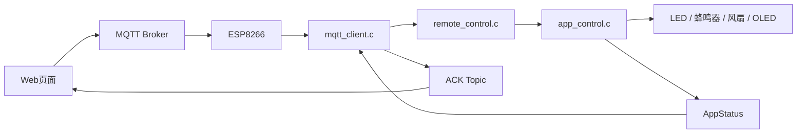
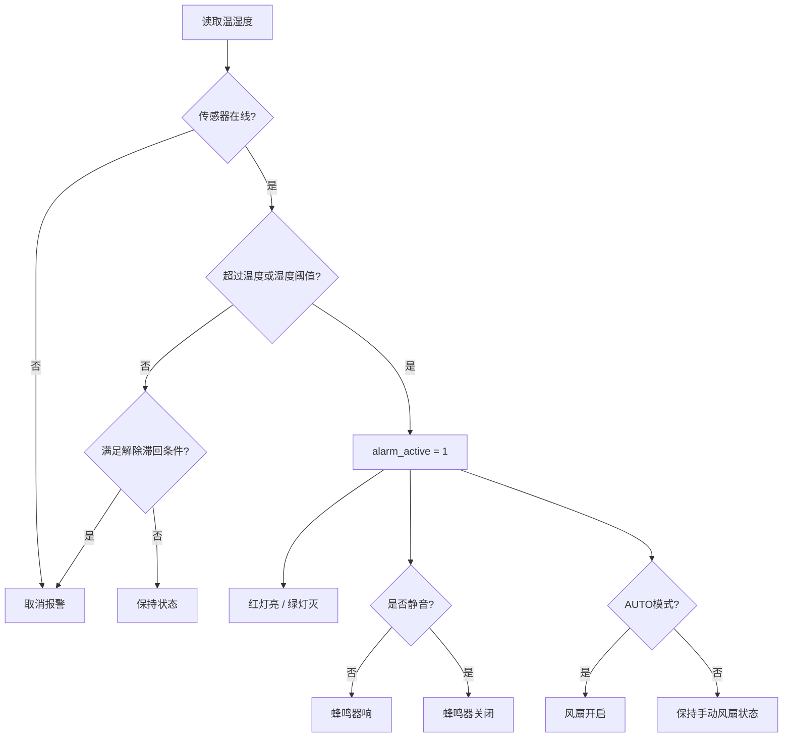

# STM32 Temperature Humidity MQTT System

<p align="center">
  
  
  
  
  
  
  
</p>

<p align="center">
  基于 <b>STM32F103、SHT30、SSD1306 OLED、ESP8266 与 MQTT</b> 的智能温湿度监测与控制系统
</p>

系统集成本地温湿度采集、OLED 状态显示、阈值报警、自动/手动风扇控制、蜂鸣器静音、按键配置、Flash 掉电保存，以及网页端 MQTT 远程监控与控制。

---

## 摘要

本项目以 STM32F103 为核心控制器，使用 SHT30 采集环境温湿度，通过 SSD1306 OLED 完成本地数据显示，并依据可配置的温度、湿度阈值控制 LED、蜂鸣器和风扇。

系统支持 `AUTO` 与 `MANUAL` 两种风扇控制模式：

- `AUTO`：风扇跟随报警状态自动启停；
- `MANUAL`：用户可通过按键或网页远程控制风扇。

ESP8266 通过 USART1 与 STM32 通信，固件采用非阻塞 MQTT 状态机完成 Wi-Fi 接入、Broker 连接、Topic 订阅、周期状态上报、远程命令接收和断线重连。系统主循环使用裸机协作式调度，不依赖 RTOS。

---

## 核心特性

- SHT30 温湿度实时采集；
- SSD1306 OLED 本地状态显示；
- 温度、湿度阈值本地设置与远程设置；
- 红绿 LED 报警状态指示；
- 蜂鸣器报警与静音控制；
- 自动/手动双模式风扇控制；
- K1、K2、K3 按键交互；
- Flash 配置掉电保存；
- ESP8266 Wi-Fi 联网；
- MQTT 状态上传、命令下发与 ACK 应答；
- 网页端温湿度监测和远程控制；
- 非追赶式主循环任务调度；
- 基于真实时间的按键消抖和长按判断；
- OLED 按需刷新；
- 非阻塞 MQTT 连接状态机；
- 网络异常自动重连；
- 报警滞回，减少阈值附近反复启停。

---

## 目录

- [系统总体架构](#系统总体架构)
- [硬件组成](#硬件组成)
- [硬件接线](#硬件接线)
- [软件架构](#软件架构)
- [功能模块](#功能模块)
- [技术栈](#技术栈)
- [项目结构](#项目结构)
- [核心设计](#核心设计)
- [MQTT通信](#mqtt通信)
- [业务流程](#业务流程)
- [快速开始](#快速开始)
- [演示指南](#演示指南)
- [测试结果](#测试结果)
- [常见问题](#常见问题)
- [文档说明](#文档说明)
- [后续计划](#后续计划)
- [License](#license)

---

## 系统总体架构

### 系统框图



### 数据流

```text
本地采集链路
SHT30 → app_control.c → 报警判断 → LED / 蜂鸣器 / 风扇 / OLED

本地操作链路
按键GPIO → key.c → 按键事件 → app_control.c → 模式 / 阈值 / 风扇

远程控制链路
Web → MQTT Broker → ESP8266 → mqtt_client.c
    → remote_control.c → app_control.c → 硬件输出

状态上报链路
app_control.c → AppStatus → mqtt_client.c → MQTT Broker → Web
```

### 各子系统职责

| 子系统 | 主要职责 |
|---|---|
| STM32F103 固件 | 传感器采集、业务判断、本地交互、执行器控制和网络任务调度 |
| ESP8266 | Wi-Fi 接入、MQTT AT 指令执行、串口数据收发 |
| MQTT Broker | 转发状态、控制命令和执行应答 |
| Web Dashboard | 展示设备状态、下发远程控制命令 |
| Hardware | 温湿度感知、信息显示、声光报警和风扇执行 |
| Docs | 保存架构、调试、测试、硬件和部署资料 |

系统的核心业务状态由 `app_control.c` 统一维护。按键控制和网页控制最终均调用业务层接口，避免本地逻辑与远程逻辑各自维护一套状态。

---

## 硬件组成

| 模块 | 型号 / 类型 | 作用 |
|---|---|---|
| 主控制器 | STM32F103 | 运行固件并调度全部业务 |
| 温湿度传感器 | SHT30 | 采集温度与相对湿度 |
| 显示模块 | SSD1306 OLED | 显示温湿度、模式、风扇和网络状态 |
| 网络模块 | ESP8266 | Wi-Fi 与 MQTT 通信 |
| 执行器 | 风扇 | 自动或手动通风控制 |
| 声音报警 | 蜂鸣器 | 报警提示，可静音 |
| 状态指示 | 红绿 LED | 显示正常与报警状态 |
| 用户输入 | K1 / K2 / K3 | 页面、阈值、模式、风扇和静音控制 |
| 存储 | STM32 内部 Flash | 保存阈值和控制模式 |

---

## 硬件接线

### 引脚对照表

> 当前代码已确认 OLED 使用 I2C1，ESP8266 使用 USART1。其他精确引脚将在核对 `.ioc` 和原理图后补齐，请勿根据常见默认引脚直接推断。

| 模块 | 信号 | STM32 接口 / 引脚 | 说明 |
|---|---|---|---|
| SSD1306 | SCL | I2C1 / PB6 | 当前主程序说明中使用 PB6 |
| SSD1306 | SDA | I2C1 / PB7 | 当前主程序说明中使用 PB7 |
| SHT30 | SCL | 待核对 `.ioc` | I2C 时钟 |
| SHT30 | SDA | 待核对 `.ioc` | I2C 数据 |
| ESP8266 | TX | USART1 RX，待核对具体引脚 | ESP8266 → STM32 |
| ESP8266 | RX | USART1 TX，待核对具体引脚 | STM32 → ESP8266 |
| KEY1 | GPIO | 待补充 | 页面切换 |
| KEY2 | GPIO | 待补充 | 阈值增加、模式和风扇 |
| KEY3 | GPIO | 待补充 | 阈值降低和静音 |
| 风扇 | Control | 待补充 | 建议经驱动电路控制 |
| 蜂鸣器 | Control | 待补充 | GPIO 输出 |
| 红 LED | Control | 待补充 | 报警指示 |
| 绿 LED | Control | 待补充 | 正常指示 |

### 原理图

```text
Hardware/Schematic/
├─ STM32_TEMP_FAN_SCH.pdf
├─ STM32_TEMP_FAN_SCH.png
└─ Source/
```

<!--  -->

### 接线图

```text
Hardware/Wiring/
├─ module-wiring.png
└─ README.md
```

<!--  -->

---

## 软件架构



### 调度层

`main.c` 负责系统初始化、三个周期任务调度和 UART 接收回调转发。

### 业务层

`app_control.c` 是系统核心，负责温湿度状态、阈值、报警、风扇、蜂鸣器、LED、按键业务、OLED 内容和远程接口。

### 驱动层

| 文件 | 职责 |
|---|---|
| `key.c` | GPIO读取、消抖、短按和长按事件 |
| `sht30.c` | SHT30初始化与数据读取 |
| `ssd1306.c` | OLED缓冲区和整屏刷新 |
| `fan.c` | 风扇启停 |
| `buzzer.c` | 蜂鸣器控制 |
| `led.c` | 红绿LED控制 |
| `esp8266.c` | UART环形缓冲、AT命令和响应处理 |

### 配置层

`app_config.c` 使用内部 Flash 保存温湿度阈值、控制模式、手动风扇状态、配置版本和校验和。

### 网络层

| 文件 | 职责 |
|---|---|
| `network_config.c` | Wi-Fi、Broker、Client ID、账号和 Topic 配置 |
| `esp8266.c` | ESP8266 AT 驱动 |
| `mqtt_client.c` | 联网、订阅、发布、ACK和重连状态机 |
| `remote_control.c` | 命令解析、参数检查和业务接口调用 |

---

## 功能模块

### 温湿度采集

SHT30 数据转换为扩大 10 倍的整数保存：

```text
28.3℃     → temp_x10 = 283
65.7%RH   → humidity_x10 = 657
```

### 报警

传感器在线且温度或湿度超过阈值时触发报警。报警后红灯亮、绿灯灭、未静音时蜂鸣器响，AUTO 模式下风扇开启。

### 风扇

```text
AUTO 模式：风扇跟随 alarm_active
MANUAL 模式：风扇跟随 manual_fan_enabled
```

### OLED

OLED 显示温湿度、AUTO/MANUAL、风扇状态、阈值设置页面、网络状态和传感器离线提示，并采用按需刷新。

### 按键

| 页面 / 模式 | K1短按 | K2短按 | K2长按 | K3短按 |
|---|---|---|---|---|
| 正常页面 AUTO | 切换页面 | 无操作 | 切换到 MANUAL | 报警时静音 |
| 正常页面 MANUAL | 切换页面 | 风扇 ON/OFF | 切换回 AUTO | 报警时静音 |
| 温度设置页 | 切换页面 | 温度阈值 +0.5℃ | 不处理 | 温度阈值 -0.5℃ |
| 湿度设置页 | 切换页面 | 湿度阈值 +1.0%RH | 不处理 | 湿度阈值 -1.0%RH |

### MQTT

完成周期状态上传、远程命令订阅、ACK、重连、发布失败处理和网络状态显示。

### 网页

计划支持实时温湿度、传感器状态、报警状态、风扇状态、模式切换、阈值修改、风扇控制、静音和多设备选择。

---

## 技术栈

| 分类        | 技术                            |
| --------- | ----------------------------- |
| MCU       | STM32F103                     |
| 固件框架      | STM32 HAL                     |
| 固件开发      | C                             |
| 工程生成      | STM32CubeMX                   |
| IDE / 编译器 | Keil MDK-ARM / ARM Compiler 5 |
| 传感器       | SHT30                         |
| 显示        | SSD1306 OLED                  |
| 网络模块      | ESP8266 AT Firmware           |
| 通信协议      | UART、I2C、MQTT                 |
| Broker    | Mosquitto                     |
| Web       | HTML、CSS、JavaScript           |
| 配置存储      | STM32 Internal Flash          |
| 调度方式      | 裸机协作式周期调度                     |
| 版本控制      | Git / GitHub                  |

---

## 项目结构

以下为规划中的最终仓库结构。目录重构前，请以当前仓库实际路径为准。

```text
STM32_Temperature_Humidity_MQTT_System/
│
├─ Firmware/
│  └─ STM32_TEMP_FAN_CTRL/
│     ├─ Core/
│     │  ├─ Inc/
│     │  └─ Src/
│     ├─ Drivers/
│     ├─ MDK-ARM/
│     ├─ STM32_TEMP_FAN_CTRL.ioc
│     ├─ .mxproject
│     └─ README.md
│
├─ Hardware/
│  ├─ Schematic/
│  ├─ Wiring/
│  ├─ BOM/
│  └─ Images/
│
├─ Web/
│  ├─ src/
│  └─ README.md
│
├─ Server/
│  └─ Mosquitto/
│     ├─ mosquitto.conf
│     ├─ topic_list.md
│     ├─ deploy_notes.md
│     └─ README.md
│
├─ Docs/
│  ├─ Architecture/
│  ├─ Development/
│  ├─ Debug/
│  ├─ Test/
│  └─ Images/
│
├─ .gitignore
├─ README.md
├─ CHANGELOG.md
└─ LICENSE
```

`Core`、`Drivers`、`MDK-ARM`、`.ioc` 和 `.mxproject` 属于同一个 STM32 工程，应整体移动并保持相对位置不变。

---

## 核心设计

### 1. 非追赶式任务调度

旧式 `while` 追赶调度会在重任务超时后连续补跑。当前使用 `if`，并将 `task_tick` 更新为当前时间，错过周期不追赶。

### 2. 按键消抖与长按

旧式驱动把调用次数当作时间，隐含“每次调用严格相隔10ms”的前提。当前应基于 `HAL_GetTick()` 真实时间判断消抖和长按。

### 3. OLED按需刷新

OLED 仅在页面、温湿度、阈值、模式、风扇、报警、静音或网络状态变化时刷新，避免整屏 I2C 刷新长期占用主循环。

### 4. MQTT非阻塞状态机

```text
Wi-Fi模式
→ 连接热点
→ 清理旧会话
→ 配置MQTT身份
→ 连接Broker
→ 订阅Topic
→ ONLINE
```

每一步采用“发送 → 返回 → 下次任务检查 → 推进”的方式，不在函数中原地等待。

### 5. Flash延迟保存

```text
修改RAM配置
→ 立即更新业务状态
→ 设置保存请求
→ 低频任务统一写入Flash
```

### 6. 报警滞回

```text
温度触发：temperature >= temperature_limit
温度解除：temperature <= temperature_limit - 0.5℃

湿度触发：humidity >= humidity_limit
湿度解除：humidity <= humidity_limit - 2.0%RH
```

### 7. AUTO/MANUAL控制

- K2 长按双向切换 AUTO / MANUAL；
- AUTO → MANUAL 时继承当前真实风扇状态；
- MANUAL 下 K2 短按控制风扇；
- MANUAL → AUTO 后风扇重新跟随报警；
- 网页命令与本地按键调用同一业务层逻辑。

---

## MQTT通信

### Topic

默认设备编号：

```text
TEMP-FAN-001
```

| 方向 | Topic | 用途 |
|---|---|---|
| 设备 → 云端 | `temp-fan/TEMP-FAN-001/status` | 周期上传设备状态 |
| 云端 → 设备 | `temp-fan/TEMP-FAN-001/command` | 下发控制命令 |
| 设备 → 云端 | `temp-fan/TEMP-FAN-001/ack` | 返回命令处理结果 |

实际 Topic 以 `network_config.c` 为准。

### 上传JSON

```json
{
  "temp_x10": 283,
  "humidity_x10": 657,
  "fan": 1,
  "alarm": 0,
  "sensor": 1
}
```

### 下发命令

```text
mode=auto
mode=manual
fan=on
fan=off
tempMax=30
humidityMax=75
mute=1
mute=0
```

- `tempMax=30` 表示 30℃；
- `humidityMax=75` 表示 75%RH；
- `fan=on/off` 会进入 MANUAL 模式并控制风扇。

### ACK格式

成功：

```text
ok=mode=auto
ok=fan=on
ok=tempMax=30
```

失败：

```text
error=invalid_temp
error=invalid_humidity
error=unknown_command
```

---

## 业务流程

### 本地按键流程



### MQTT联网流程



### 网页控制流程



### 报警联动流程



---

## 快速开始

### 硬件准备

- STM32F103 开发板或主控板；
- ST-Link；
- SHT30；
- SSD1306 OLED；
- ESP8266；
- 风扇及驱动电路；
- 蜂鸣器、LED 和三个按键；
- 稳定电源。

### 网络配置

公开仓库不要提交真实 Wi-Fi 和 MQTT 密码。建议提供 `network_config.example.c`，本地使用被 Git 忽略的私有配置。

### Keil编译

规划目录：

```text
Firmware/STM32_TEMP_FAN_CTRL/MDK-ARM/STM32_TEMP_FAN_CTRL.uvprojx
```

若尚未重构目录，则从当前 `MDK-ARM/` 打开工程。

执行：

```text
Project → Rebuild all target files
```

确认：

```text
0 Error(s)
```

### 烧录

1. 连接 ST-Link；
2. `Flash → Download`；
3. 复位设备；
4. 等待 OLED 显示 `NET:ONLINE`；
5. 使用 MQTTX 或网页确认状态数据。

### 网页运行

网页部署方法将在 `Web/README.md` 单独说明，包括 WebSocket MQTT、Broker、Topic、多设备选择和服务器部署。

---

## 演示指南

1. 上电并展示网络状态变化；
2. 展示温湿度实时采集；
3. 使用 K1 切换页面；
4. 使用 K2、K3 修改阈值；
5. 触发报警，展示 LED、蜂鸣器和 AUTO 风扇联动；
6. 使用 K3 静音；
7. K2 长按进入 MANUAL；
8. K2 短按控制风扇；
9. 再次长按返回 AUTO；
10. 网页修改阈值并观察硬件响应；
11. 网页控制模式、风扇和静音；
12. 断网后展示本地功能；
13. 恢复网络并展示自动重连。

---

## 测试结果

当前项目处于功能集成和回归测试阶段。

| 测试项目 | 当前状态 | 说明 |
|---|---|---|
| 上电初始化 | 已实现，待完整回归 | OLED、传感器、风扇和网络初始化 |
| K1 页面切换 | 已完成专项排查 | 裸GPIO、驱动、OLED和业务分层测试 |
| K2 模式与风扇 | 业务逻辑已调整 | 需按最终交互重新执行用例 |
| OLED 按需刷新 | 已修复 | 避免重复整屏刷新拖慢按键 |
| MQTT 联网 | 已实现 | 使用非阻塞状态机 |
| MQTT 状态上传 | 已实现 | 周期上传温湿度和设备状态 |
| 网页状态显示 | 已实现 | 可接收设备状态 |
| 网页阈值下发 | 已实现 | 修改后立即重算报警 |
| AUTO 风扇联动 | 已实现 | 风扇跟随报警状态 |
| MANUAL 风扇控制 | 已实现 | 按键或网页控制 |
| Flash 掉电保存 | 已实现，待专项测试 | 使用延迟保存 |
| 断网自动重连 | 已实现，待压力测试 | 本地功能不应受网络影响 |
| 长时间运行 | 未完成 | 建议执行 8h / 24h 测试 |

---

## 常见问题

### 加入 MQTT 后按键无法操作

重点检查 MQTT 是否重复更新相同网络文字并触发 OLED 高频整屏刷新。当前方案只在状态变化时通知 OLED，并在业务层按需刷新。

### OLED一直显示 `NET:START`

检查 `MqttClient_Task()` 是否被周期调用、状态更新接口是否被完全注释，以及 ESP8266 是否收到 AT 响应。

### STM32复位后无法重连，断电后可以

ESP8266 可能保留旧 MQTT 会话。连接状态机使用 `AT+MQTTCLEAN=0` 清理旧会话后再重新配置。

### 网页改阈值后蜂鸣器变化，但风扇不变化

确认当前模式。AUTO 模式风扇跟随报警，MANUAL 模式风扇跟随手动配置。

### `git push`成功，但最新代码没有上传

`git push` 只上传已经 Commit 的内容：

```bash
git add <file>
git commit -m "说明"
git push
```

### 公开仓库能否上传真实网络配置

不能。应提供 example 配置并忽略私有文件。若密码已经进入公开 Git 历史，应立即更换。

---

## 文档说明

```text
Docs/
├─ Architecture/       # 系统架构、数据流、状态所有权
├─ Development/        # 软件模块、接口和代码讲解
├─ Debug/              # 按键、OLED、联网等问题排查
├─ Test/               # 测试计划、报告和Bug记录
└─ Images/             # 实物、网页、MQTTX和演示截图
```

```text
Hardware/
├─ Schematic/          # 原理图及源文件
├─ Wiring/             # 接线图和说明
├─ BOM/                # 物料清单
└─ Images/             # PCB和实物照片
```

```text
Server/Mosquitto/
├─ mosquitto.conf
├─ topic_list.md
├─ deploy_notes.md
└─ README.md
```

---

## 后续计划

- [ ] 核对并补全 GPIO 引脚表；
- [ ] 上传原理图 PDF、PNG 和源文件；
- [ ] 补充模块接线图与供电说明；
- [ ] 完成仓库目录重构；
- [ ] 将真实网络配置与示例配置分离；
- [ ] 整理网页源码和部署说明；
- [ ] 补充 Mosquitto 配置与安全说明；
- [ ] 执行完整回归测试；
- [ ] 执行断网重连压力测试；
- [ ] 执行 8 小时 / 24 小时稳定性测试；
- [ ] 补充实物图、网页效果图和演示视频；
- [ ] 发布 `v1.0.0`；
- [ ] 将 `.hex` / `.bin` 作为 GitHub Release 附件发布；
- [ ] 增加多设备选择与状态管理。

---

## License

本项目采用 [MIT License](LICENSE)。
