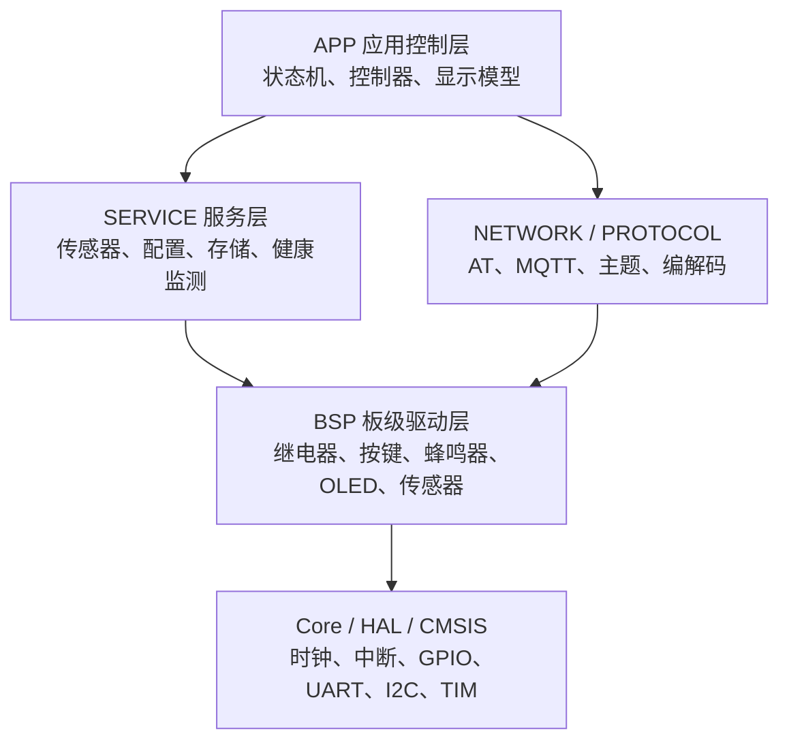
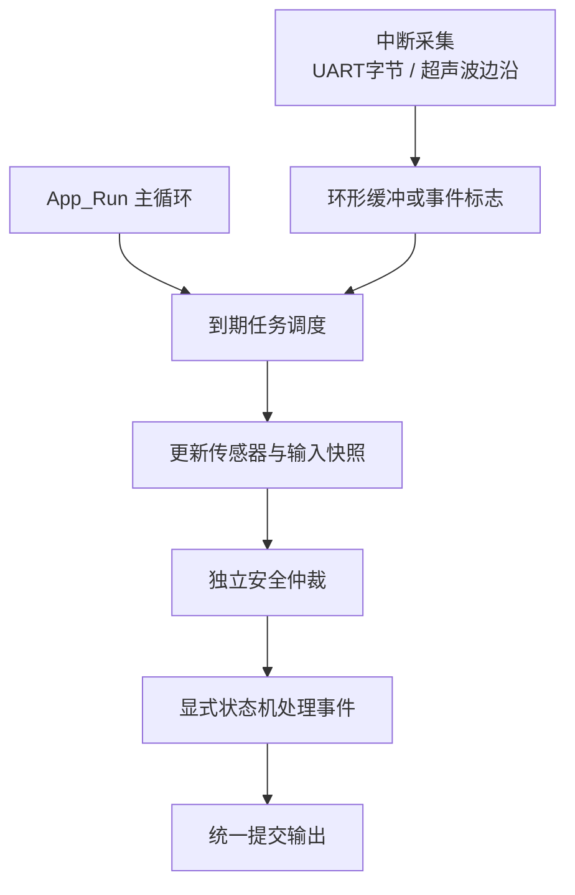
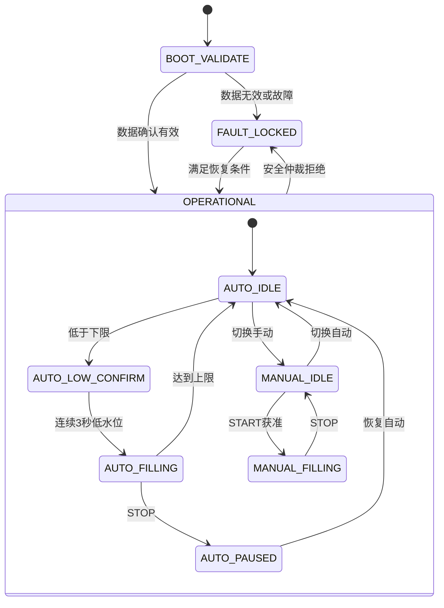

# 智能水箱控制器 V5.0 软件架构

## 1. 架构结论

V5.0 采用“分层模块化裸机控制架构”，不使用 FreeRTOS。运行核心由四部分组成：

1. 协作式时间调度器：按周期调用模块，不阻塞、不使用长延时。
2. 事件命令队列：统一接收按键、MQTT、配置和系统事件。
3. 显式层次状态机：明确保存运行模式和控制状态，集中处理状态转换。
4. 独立安全仲裁器：每轮直接检查安全快照，拥有水泵最终否决权，不依赖普通命令队列。

当前优化版 V4.5 是 V5.0 重构的稳定基线，不应在架构重构完成前标记为 V5.0。

## 2. 分层结构



依赖只能向下。BSP不得引用APP，协议层不得直接控制继电器，网络层不得修改状态机内部变量。

| 层级 | 负责 | 不负责 |
|---|---|---|
| Core/HAL | 芯片启动、外设初始化、中断入口 | 业务判断 |
| BSP | 单个硬件器件的最小驱动 | 自动补水、报警策略 |
| COMMON | 时间、队列、CRC、轻量解析、通用工具 | 设备业务 |
| SERVICE | 采样、滤波、标定、参数持久化、健康状态 | MQTT主题、页面字段 |
| PROTOCOL | 命令/配置/遥测数据格式 | 串口收发、泵控制 |
| NETWORK | 4G入网、MQTT连接、发布订阅、重连 | 安全决策 |
| APP | 模式、状态机、安全仲裁、输出决策、显示模型 | 寄存器操作 |

## 3. 裸机运行模型

中断服务程序只完成最少工作：记录字节、边沿或时间戳，然后立即退出。所有解析、显示、状态转换和Flash写入都在主循环中完成。



任何模块都不得调用 `HAL_Delay()` 等待业务过程，也不得在 `while` 中等待传感器或4G回复。

## 4. 事件命令队列

事件队列解决“按键、网页和系统事件同时到达时由谁处理”的问题。

```c
typedef enum
{
    APP_EVENT_NONE = 0,
    APP_EVENT_START,
    APP_EVENT_STOP,
    APP_EVENT_MODE_AUTO,
    APP_EVENT_MODE_MANUAL,
    APP_EVENT_MUTE,
    APP_EVENT_CONFIG_APPLY,
    APP_EVENT_LOW_LEVEL_CONFIRMED,
    APP_EVENT_HIGH_LEVEL_REACHED
} AppEventType_t;

typedef struct
{
    AppEventType_t type;
    AppEventSource_t source;
    uint32_t timestamp_ms;
    AppEventPayload_t payload;
} AppEvent_t;
```

约束：

- 本地按键和MQTT先转换为统一事件，再交给状态机。
- STOP使用独立停止锁存，不能因队列满而丢失。
- 故障保护不排队等待，安全仲裁器直接强制输出关闭。
- 队列满时记录丢失计数并上报健康状态。
- ISR不投递包含复杂数据的事件，不在ISR解析JSON。

## 5. 显式层次状态机

显式状态机是用一个明确的枚举变量保存当前状态，并通过集中转换函数改变状态。不得使用分散在多个文件中的布尔变量组合来“猜测状态”。



状态机负责“想不想开泵”，安全仲裁器负责“允不允许开泵”。二者不能合并成一个巨大函数。

## 6. 独立安全仲裁器

安全仲裁器每轮读取不可变安全快照，输出唯一的许可结果：

```c
typedef struct
{
    bool startup_confirmed;
    bool level_valid;
    bool pressure_valid;
    bool high_level;
    bool over_pressure;
    bool max_runtime_reached;
} SafetyInput_t;

typedef struct
{
    bool pump_permitted;
    SafetyReason_t primary_reason;
    uint32_t active_faults;
} SafetyDecision_t;
```

最终输出必须满足：

```text
pump_output = state_machine_requests_pump AND safety_decision.pump_permitted
```

安全优先级：

1. 上电数据未确认、传感器无效；
2. 压力过高；
3. 水位达到上限；
4. 最长运行时间到；
5. STOP停止锁存；
6. 自动/手动控制请求。

网页、本地按键、MQTT和状态机均不得直接调用继电器开启接口。只有统一输出提交模块可以控制继电器。

## 7. 数据所有权

| 数据 | 唯一拥有者 | 其他模块访问方式 |
|---|---|---|
| 水位、距离、压力 | SensorService | 只读快照 |
| 阈值和标定参数 | ConfigService | 校验后提交 |
| 工作模式和状态 | AppStateMachine | 查询接口 |
| 故障位和许可 | SafetyArbiter | 只读决策结果 |
| MQTT连接状态 | NetworkManager | 只读网络快照 |
| 继电器实际输出 | ActuatorService | 查询实际状态 |

禁止跨模块直接修改全局变量。共享数据通过结构化快照传递，保证高内聚、低耦合。

## 8. 推荐任务周期

| 周期 | 任务 |
|---:|---|
| 1ms/中断 | HAL Tick、UART字节接收、超声波边沿记录 |
| 10ms | 按键消抖、事件入队 |
| 20ms | 状态机和安全仲裁 |
| 100ms | 压力采样、输出及报警更新 |
| 200ms | 超声波测量与滤波 |
| 500ms | OLED增量刷新、健康监测 |
| 5s | MQTT周期状态上报 |
| 立即 | 故障、报警、ACK上报 |

所有周期采用无符号时间差或到期比较，正确处理 `HAL_GetTick()` 回绕。

## 9. 工程质量规则

- 公共头文件只公开必要类型和API，内部函数保持 `static`。
- 一个模块只负责一类变化原因。
- 禁止重复定义同一状态、阈值或Topic。
- 禁止动态内存；缓冲区固定容量并检查边界。
- 字符串编解码必须检查返回值和截断。
- 安全逻辑、状态转换和协议解析必须有主机单元测试。
- Debug保持零错误，目标零警告；Release必须记录RAM/Flash占用。
- 每次提交只完成一个明确目标，架构重构和业务功能修改分开提交。

